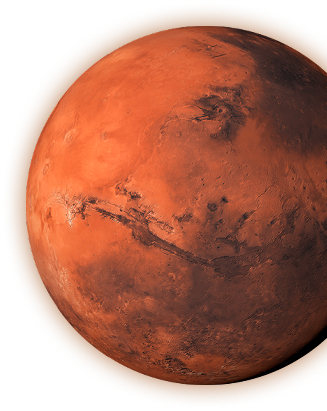
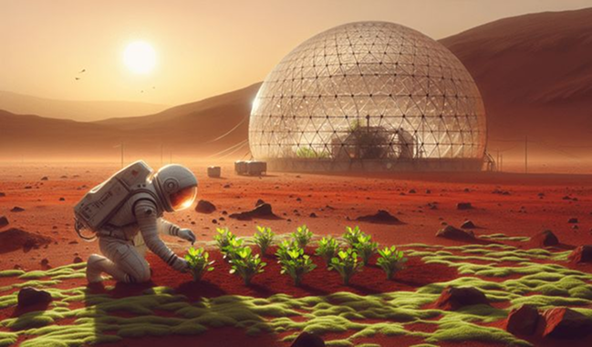

# 🚀 Void Seed

### Cultivando a Vida Além da Terra

---

## 📖 Descrição do Projeto

O **Void Seed** é uma plataforma web desenvolvida para monitorar e gerenciar plantações em Marte, auxiliando futuras colônias humanas na produção sustentável de alimentos em ambientes extremos.

Inspirado nos desafios reais da exploração espacial, o projeto busca demonstrar como a tecnologia e a agricultura de precisão podem contribuir para a sobrevivência humana fora da Terra.

A plataforma permite acompanhar o crescimento das culturas, calcular indicadores agrícolas e disponibilizar informações sobre agricultura marciana de forma intuitiva e acessível.

---

## 🎯 Objetivo do Projeto

O principal objetivo do **Void Seed** é demonstrar como sistemas de monitoramento agrícola podem auxiliar na produção sustentável de alimentos em Marte.

A solução foi desenvolvida para simular uma plataforma utilizada por cientistas e astronautas responsáveis pelo cultivo de alimentos em futuras colônias espaciais, permitindo o acompanhamento das plantações e a análise de indicadores agrícolas importantes para a tomada de decisões.

---

## 🛠️ Tecnologias Utilizadas

As seguintes tecnologias foram utilizadas no desenvolvimento do projeto:

- HTML5
- CSS3
- JavaScript
- Figma
- Git
- GitHub
- Visual Studio Code

---

## 📂 Estrutura de Pastas


VoidSeed/
│
├── assets/
│   ├── arthur.png
│   ├── calculadora.png
│   ├── colheita.png
│   ├── estufa.jpg
│   ├── estufa.png
│   ├── henrique.png
│   ├── imagem_faq.png
│   ├── imagem_sobre.png
│   ├── ludmylla.png
│   ├── MARS.png
│   ├── melissa.png
│   ├── pedro.png
│   ├── skill-icons--linkedin.png
│   └── uil--github.png
│
├── css/
<<<<<<< HEAD
│   ├── calculadora.css
│   ├── contato.css
│   ├── faq.css
│   ├── integrantes.css
│   ├── plantacoes.css
│   ├── sobre.css
│   └── style.css
=======
│   ├── style.css
│   ├── calculadora.css
│   ├── integrantes.css
│   └── plantacoes.css
>>>>>>> 3d6598fb9c893d6d6bf36f9c2a47be8146852476
│
├── js/
│   ├── calculadora.js
│   └── plantacoes.js
│
<<<<<<< HEAD
├── calculadora.html
├── contato.html
├── faq.html
├── index.html
├── integrantes.html
├── plantacoes.html
├── README.md
├── sobre.html

=======
├── index.html
├── calculadora.html
├── contato.html
├── faq.html
├── integrantes.html
├── plantacoes.html
├── sobre.html
│
└── README.md


---

## 🌐 Funcionalidades

### 🏠 Página Inicial
Apresentação da missão Void Seed e acesso rápido às principais funcionalidades da plataforma.

### 📊 Calculadora Agrícola
Permite calcular:

- Taxa de Crescimento Diária
- Densidade de Plantio

### 🌱 Plantações
Monitoramento das culturas agrícolas, acompanhando informações como crescimento, temperatura, umidade e produtividade.

### 🚀 Sobre
Apresenta o problema enfrentado pela agricultura em Marte, a solução proposta e as tecnologias utilizadas no projeto.

### ❓ FAQ
Perguntas frequentes relacionadas ao cultivo em Marte e ao funcionamento da plataforma.

### 👥 Integrantes
Apresentação dos membros da equipe e seus contatos profissionais.

### 📞 Contato
Canal de comunicação para envio de dúvidas, sugestões e feedbacks.

---

## 📸 Imagens do Projeto

### 🏠 Página Inicial



### 📊 Página Calculadora


### 🚀 Página Sobre



### ❓ Página FAQ


### 🌱 Agricultura em Marte


---

## 👨‍💻 Autores e Créditos

### Ludmylla Nogueira

**RM:** 572999  
**Turma:** TDSPX

**LinkedIn:** https://www.linkedin.com/in/ludmylla-nogueira-11991927a

**GitHub:** https://github.com/Ludmylla1905

---

### Arthur Almeida

**RM:** 573170  
**Turma:** TDSPX

**LinkedIn:** https://www.linkedin.com/in/arthur-almeida-864a31315

**GitHub:** https://github.com/arthur04072007

---

### Henrique Tavares Coutinho

**RM:** 569336  
**Turma:** TDSPX

**LinkedIn:** https://www.linkedin.com/in/henrique-tavares-coutinho-81a512356

**GitHub:** https://github.com/eneiqmaneiro

---

### Melissa Fiuza da Silva

**RM:** 573695  
**Turma:** TDSPX

**LinkedIn:** https://www.linkedin.com/in/melissa-fiuza

**GitHub:** https://github.com/melissafiuza

---

### Pedro Nunes Ferreira

**RM:** 573066  
**Turma:** TDSPX

**LinkedIn:** https://www.linkedin.com/in/pedro-nunes-1089133b4

**GitHub:** https://github.com/Pedronuf

---

## 🔗 Link do Repositório

Acesse o repositório oficial do projeto:

```text
https://github.com/melissafiuza/Global-Solution
```

---

## 📞 Contato

Caso tenha dúvidas, sugestões ou queira entrar em contato com a equipe:

📧 ludmilanogueira231@gmail.com

📧 arthuralmeida0803@gmail.com

📧 melfiuza153@gmail.com

---


# 🌱 Void Seed

### "Plantando o futuro da humanidade além da Terra."
